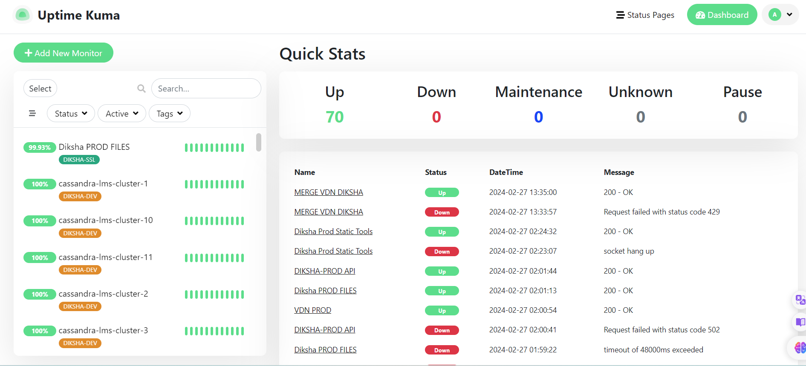
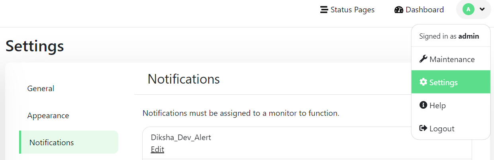
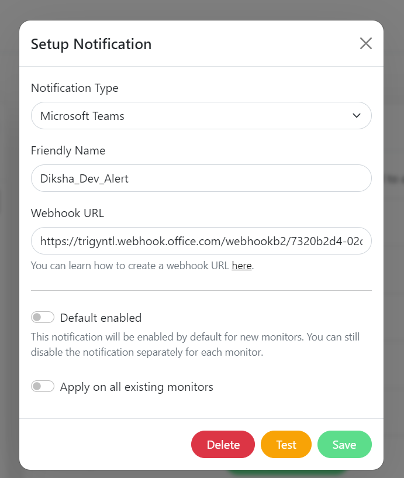

<div align="center" width="100%">
    
</div>

# Uptime Kuma for DIKSHA

Uptime Kuma is an easy-to-use self-hosted monitoring tool.

Uptime Kuma is now running on 

- ✅ DEV - https://jenkins.oci.diksha.gov.in/uptime
- ✅ PROD -https://10.90.12.71:8443/dashboard/home


- Username : admin
- Password: Admin@123



## Notification

- Enabled in MS Teams and Salck using webhook
- Go to profile --> settings--> notification



- click on the edit any notification




## ⭐ Features

- Monitoring uptime for HTTP(s) / TCP / HTTP(s) Keyword / HTTP(s) Json Query / Ping / DNS Record / Push / Steam Game Server / Docker Containers
- Fancy, Reactive, Fast UI/UX
- Notifications via Telegram, Discord, Gotify, Slack, Pushover, Email (SMTP), and [90+ notification services, click here for the full list](https://github.com/louislam/uptime-kuma/tree/master/src/components/notifications)
- 20-second intervals
- [Multi Languages](https://github.com/louislam/uptime-kuma/tree/master/src/lang)
- Multiple status pages
- Map status pages to specific domains
- Ping chart
- Certificate info
- Proxy support
- 2FA support

## 🔧 How to Install

### DEV Environment

```bash 
ssh -i <SSH KEY> ubuntu@jenkins.oci.diksha.gov.in
cd /home/ubuntu/uptime
./uptime.sh
```
### 🐳 Docker

```bash
sudo docker run -d \
  --name uptime-kuma \
  --restart always \
  -p 3001:3001 \
  -v ./data:/app/data \
  --network host \
  -e ROOT_URL=http://0.0.0.0:3001 \
  louislam/uptime-kuma
```


### Reverse Proxy

In order to expose Uptime Kuma to the web securely, it is recommended to proxy it behind a traditional webserver such as nginx or Apache. Below are some example configurations that you could use.

- Nginx

```bash 
cd /etc/nginx/sites-enabled
vi default
nginx -t
sudo service nginx restart
```

``` nginx

# Default server configuration
#
server {
        listen 80 default_server;
        listen [::]:80 default_server;

        root /var/www/html;

        server_name _;

        location / {
                # First attempt to serve request as file, then
                # as directory, then fall back to displaying a 404.
                try_files $uri $uri/ =404;
        }

}


server {
        root /var/www/html;
        index index.html index.htm index.nginx-debian.html;
    server_name jenkins.oci.diksha.gov.in; # managed by Certbot

    ## Jenkins
        location / {
        proxy_pass http://localhost:8080;
        }
 
    ## Uptime Kuma
    location /uptime {

    # Define upstream address
    #set $upstream_app uptime-kuma;
    set $url_prefix uptime;
    proxy_pass http://localhost:3001;

    # Set proxy headers
    proxy_set_header Host $host;
    proxy_set_header X-Real-IP $remote_addr;
    proxy_set_header X-Forwarded-For $proxy_add_x_forwarded_for;
    proxy_set_header X-Forwarded-Proto $scheme;
    proxy_set_header X-Forwarded-Protocol $scheme;
    proxy_set_header X-Forwarded-Host $http_host;
    proxy_http_version 1.1;
    proxy_set_header Upgrade $http_upgrade;
    proxy_set_header Connection "upgrade";
    proxy_buffering off;

    # Redirect location headers
    proxy_redirect ^ /$url_prefix;
    proxy_redirect /dashboard /$url_prefix/dashboard;

    # Remove URL prefix to pass to the app
    rewrite ^/uptime/?(.*)$ /$1 break;

    # Sub filters to replace hardcoded paths
    proxy_set_header Accept-Encoding "";
    sub_filter_once off;
    sub_filter_types *;
    sub_filter '/assets/' '/$url_prefix/assets/';
    sub_filter '"assets/' '"$url_prefix/assets/';
    sub_filter '/dashboard' '/$url_prefix/dashboard';
    sub_filter '"/socket.io"' '"/$url_prefix/socket.io"';

    sub_filter '"/icon.svg"' '"/$url_prefix/icon.svg"';
    sub_filter '"/favicon.ico"' '"/$url_prefix/favicon.ico"';
    sub_filter '"/manifest.json"' '"/$url_prefix/manifest.json"';
    }

    listen [::]:443 ssl ipv6only=on; # managed by Certbot
    listen 443 ssl; # managed by Certbot
    ssl_certificate /etc/letsencrypt/live/jenkins.oci.diksha.gov.in/fullchain.pem; # managed by Certbot
    ssl_certificate_key /etc/letsencrypt/live/jenkins.oci.diksha.gov.in/privkey.pem; # managed by Certbot
    include /etc/letsencrypt/options-ssl-nginx.conf; # managed by Certbot
    ssl_dhparam /etc/letsencrypt/ssl-dhparams.pem; # managed by Certbot

}
server {
    if ($host = jenkins.oci.diksha.gov.in) {
        return 301 https://$host$request_uri;
    } # managed by Certbot


        listen 80 ;
        listen [::]:80 ;
    server_name jenkins.oci.diksha.gov.in;
    return 404; # managed by Certbot


}
```


## SSL Certificate renewal

```bash 
sudo certbot renew --dry-run  ## Dry run to verify
sudo certbot renew 
```
